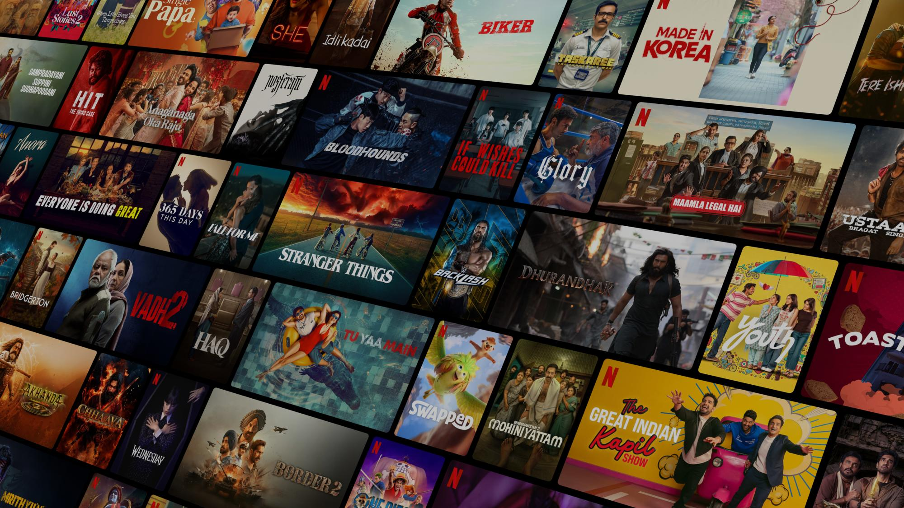

# 🎬 Netflix Clone

A pixel-perfect clone of the Netflix India landing page built with pure **HTML** and **CSS** — no frameworks, no libraries.



---

## 🌐 Live Demo

> Coming soon — deploy on [GitHub Pages](https://pages.github.com/) or [Vercel](https://vercel.com/)

---

## ✨ Features

- 🎨 **Hero Section** — Full-screen background with email signup CTA
- 🔥 **Trending Now** — Horizontally scrollable poster slider with numbered rankings
- 📋 **More Reasons to Join** — 4-card feature grid (TV, Download, Watch Everywhere, Kids)
- ❓ **FAQ Accordion** — Animated open/close questions with JavaScript
- 📧 **Email CTA** — Second signup prompt above the footer
- 🦶 **Footer** — Full Netflix-style footer with 4-column link grid and language selector
- 📱 **Responsive Design** — Works on mobile, tablet, and desktop

---

## 🛠️ Built With

| Technology | Usage |
|---|---|
| HTML5 | Page structure & semantics |
| CSS3 | Styling, flexbox, grid, animations |
| JavaScript (Vanilla) | FAQ accordion toggle |
| Google Fonts | Martel Sans + Poppins |

---

## 📁 Project Structure

```
netflix-clone/
│
├── index.html          # Main HTML file
├── style.css           # All styles
│
└── assets/
    ├── hero-bg.jpg         # Hero background image
    ├── Netflix_Logo_PMS.png # Netflix logo
    ├── Poster_1.webp        # Movie posters (1–8)
    ├── Poster_2.webp
    ├── ...
    ├── ic_1.png             # Feature icons (TV, Download, etc.)
    ├── ic_2.png
    ├── ic_3.png
    └── ic_4.png
```

---

## 🚀 Getting Started

### Option 1 — Open directly in browser
```bash
# Just double-click index.html
# or right-click → Open with → your browser
```

### Option 2 — VS Code Live Server
1. Install the **Live Server** extension in VS Code
2. Right-click `index.html` → **Open with Live Server**
3. Opens at `http://127.0.0.1:5500`

### Option 3 — Python local server
```bash
# Python 3
python -m http.server 8000

# Then open http://localhost:8000
```

---

## 📸 Screenshots

| Section | Preview |
|---|---|
| Hero | Full-screen background with email input |
| Trending | Horizontal poster scroll with large numbers |
| Features | Dark gradient cards with icons |
| FAQ | Accordion-style animated questions |
| Footer | 4-column link grid |

---

## 🎯 What I Learned

- CSS `position: absolute/relative` for layered overlays
- CSS `overflow-x: auto` + `scrollbar-width: none` for custom sliders
- `-webkit-text-stroke` for outlined number text
- CSS `max-height` transition trick for smooth accordion animation
- `clamp()` for fluid responsive typography
- CSS Grid for multi-column footer layout

---

## 🔮 Future Improvements

- [ ] Add a working login/signup page
- [ ] Integrate TMDB API for real movie data
- [ ] Add hover preview cards like real Netflix
- [ ] Build a video player page
- [ ] Make it a full React app

---

## 👨‍💻 Author

**Darshan**
- GitHub: [@yourusername](https://github.com/yourusername)

---

## 📄 License

This project is for **educational purposes only**.  
Netflix is a registered trademark of Netflix, Inc. This clone is not affiliated with or endorsed by Netflix.

---

⭐ If you found this helpful, consider giving it a star on GitHub!
